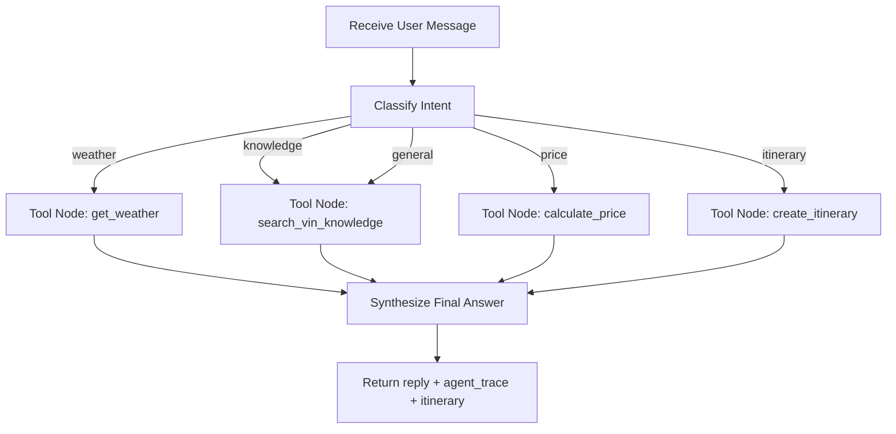

# LangGraph Flowchart

```mermaid
flowchart TD
    A[Receive User Message] --> B[Classify Intent]
    B -->|weather| C[Tool Node: get_weather]
    B -->|knowledge| D[Tool Node: search_vin_knowledge]
    B -->|price| E[Tool Node: calculate_price]
    B -->|itinerary| F[Tool Node: create_itinerary]
    B -->|general| D
    C --> G[Synthesize Final Answer]
    D --> G
    E --> G
    F --> G
    G --> H[Return reply + agent_trace + itinerary]
```
